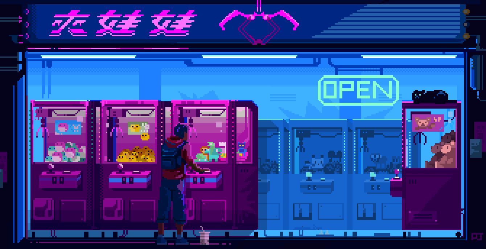

  
<!-- <h1>Hi , I'm Milymax</h1> -->
  

Background GIF by [ArtStation](https://id.pinterest.com/pin/474989091961400056/) on [Pinterest](https://www.pinterest.com/).

<!-- ## 🌐 Socials:

 &nbsp;
 &nbsp;
 -->

  
## ♟ About Me:

-🔭 I’m currently focused on Web development -🌱I’m currently learning **Frontend Tech Stack** -👯I’m looking to collaborate on Web Project -👨‍💻All of my projects are available at https://artomily.site  -📫 How to reach me **vararakya@gmail.com** -⚡Fun fact I love to take photos, traveling, and learn new things

## 💻 My Tech Stack:

<!--

<!--   

-->

## 🏆 My Stats:

    <!-- &nbsp;&nbsp; -->
    &nbsp;&nbsp;

## 💡 A Quote:

<!--  -->

____________

